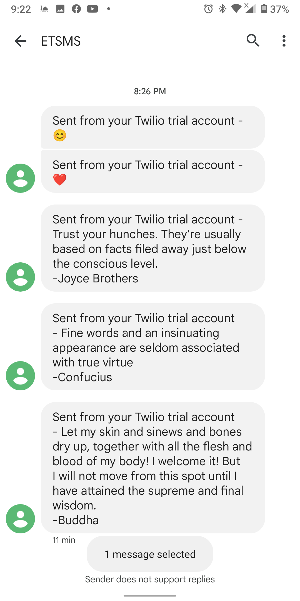

# ISO Messaging

backend apps that can send sms's to phone numbers

this app using maven

## URL
```http
POST http://localhost:8080/api/v1/sms
```

## Request Body
```json
{
  "phoneNumber": "use your phone number"
}
```

# Screen Shot


this app using twilio as an SMS provider to send a quote from quotable API